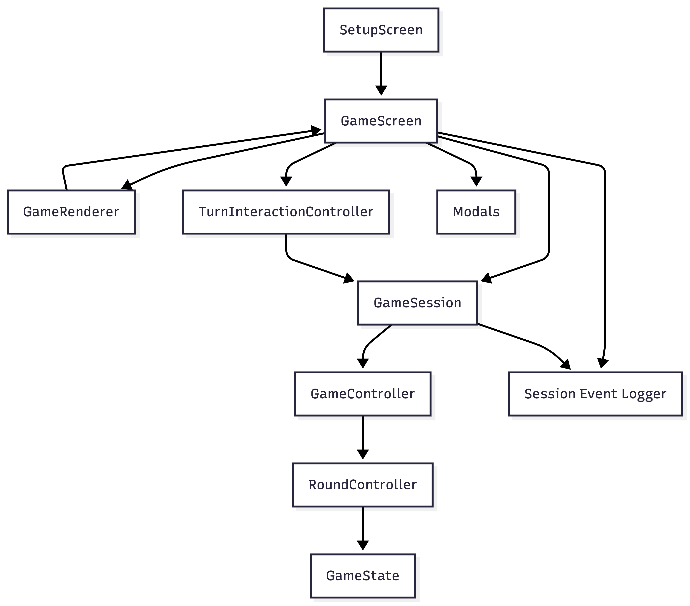
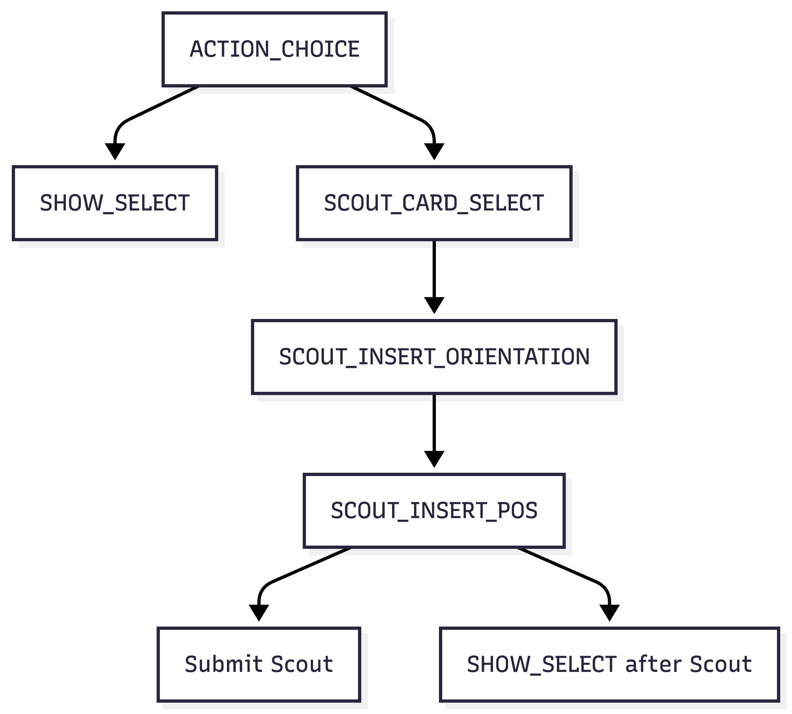

# Scoutbot TUI

This folder contains the terminal UI build with textual. The TUI focuses on rendering and handling human input the actual 
game engine is referenced. `app.py` serves as the main entry point, after that the TUI is organized into Screens.

`game/` contains the main interaction logic for playing against bots and gathering game data from human players. The 
general control flow is illustrated by the following mermaid chart:

   

The core idea:

- Controllers own game logic

- GameSession serves as an adapter and bridge between GameState and UI

- GameRenderer updates widgets

- TurnInteractionController manages human move construction

- The GameScreen coordinates everything

The UI does not compute legal moves or mutate game state directly. It just references the engine through the GameSession object.

---
## Game Flow

1. `SetupScreen` collects player count, seat types, seed
2. `GameScreen` creates RNG, bot instances, GameSession, GameRenderer and the Interaction Controller
3. `GameSession` handles starting rounds, advancing bot turns, emitting events and stopping for human input
4. `GameRenderer` reads current `GameSession` and `TurnInputState` and updates the screen accordingly
5. `TurnInteractionController` handles action choice, move selection, and subsequent flows, it matches provided moves against controller-provided legal moves
6. `GameSession` emits events like `round_started` and `move_submitted`, these are translated into log outputs by `logging/session_event_logger.py`
7. At the end of a game the `Summary Modal` is built and `GameScreen` exports the gathered Data 

---
## Human turn flow

Building a human move is a multi-step process, and therefore split into phases illustrated by the following mermaid:

   

The input layer never applies game actions directly. Instead, it matches the current user selection against the legal move list provided by the controller.